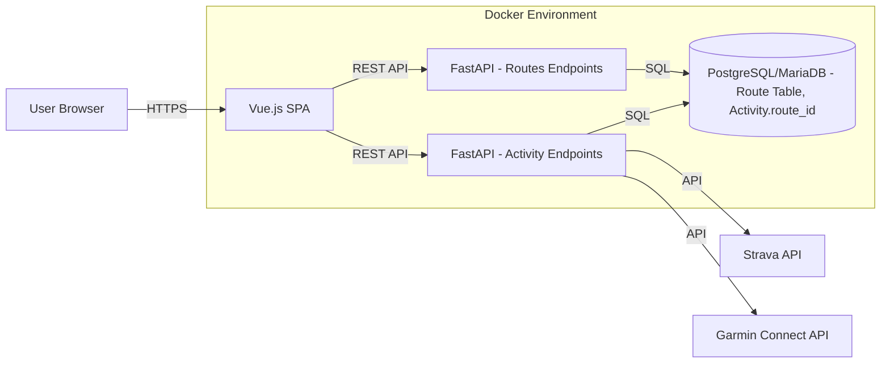

# System Patterns: Endurain

## System Architecture

Endurain follows a typical client-server architecture:

*   **Frontend (Client):** A Single Page Application (SPA) built with Vue.js. It interacts with the backend via RESTful APIs.
*   **Backend (Server):** A Python FastAPI application providing the API endpoints. It handles business logic, data processing, and database interactions.
*   **Database:** PostgreSQL or MariaDB stores application data (users, activities, routes, etc.).
*   **Deployment:** Docker containers are used for packaging and deploying the frontend, backend, and database services. Docker Compose orchestrates the local development/deployment environment.

## Key Technical Decisions

*   **Frontend Framework:** Vue.js chosen for its component-based structure and reactivity.
*   **Backend Framework:** FastAPI selected for its high performance, asynchronous capabilities, and automatic API documentation.
*   **Database ORM:** SQLAlchemy used for database interaction, providing an abstraction layer over SQL. This includes models for `User`, `Activity`, `Route`, etc. The `Activity` model will include a `route_id` foreign key.
*   **Migrations:** Alembic manages database schema migrations.
*   **Containerization:** Docker simplifies deployment and environment consistency.
*   **Integrations:** Specific libraries (`stravalib`, `python-garminconnect`) handle communication with external services.
*   **File Parsing:** Dedicated libraries (`gpxpy`, `fitdecode`) process uploaded activity files, including GPX files for Routes.

## Design Patterns

*   **RESTful API:** Standard pattern for client-server communication.
*   **Repository Pattern (implied):** Backend `crud.py` files (e.g., `activities/crud.py`, `routes/crud.py`) implement a form of the repository pattern to separate data access logic.
*   **Dependency Injection:** FastAPI utilizes dependency injection extensively.
*   **SPA (Single Page Application):** Frontend architecture pattern.
*   **Component-Based UI:** Vue.js promotes building the UI from reusable components.

## Component Relationships

*   The **Frontend** relies entirely on the **Backend API** for data and functionality.
*   The **Backend** interacts with the **Database** for persistence.
*   **Backend** modules are organized by feature (e.g., `activities`, `users`, `gears`, `routes`).
*   **Integration modules** (Strava, Garmin) are separate components within the backend.
*   **File parsing utilities** (e.g., `gpxpy`) are used by the backend when handling uploads for activities and routes.
